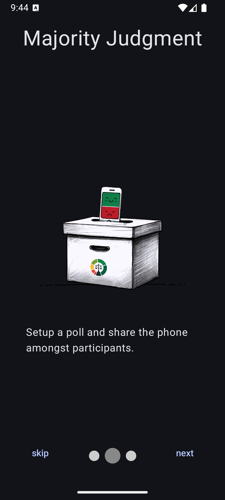
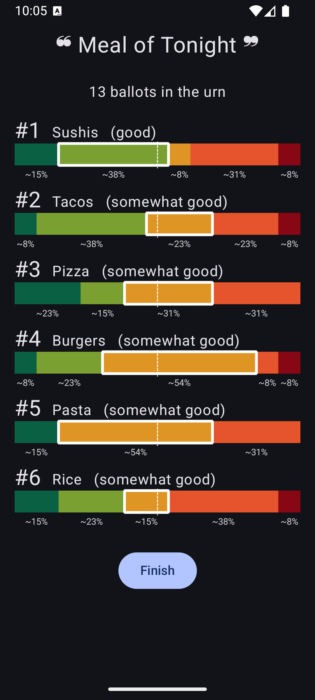

# Majority Judgment Offline Mobile Urn

An application for Android 8.1 and greater that helps groups decide about things when offline, using a single phone.

> If you're looking for an online app, try https://app.mieuxvoter.fr/

## Features

- *Mobile Urn*: Set up a local, offline poll on your phone.
- *Vote with Subtlety*: Grade each proposal and so never throw a vote away.
- *Majority Judgment*: One of the most elegant ranking systems out there.
- *Proportional Representation*: Compute a percentage for each proposal.
- *Libre Software*: We accept merge requests.
- *No anti-features*: no tracking, no ads, no permissions required.

<!--suppress CheckImageSize -->

  
  
  
  

## Tips

Since Android 11, you may enable [app pinning](https://support.google.com/android/answer/9455138?hl=en) with this app if participants are expected to have gorilla fingers or sneaky paws.

## Download

### F-Droid

This Android app is available on [F-Droid](https://f-droid.org/en/packages/com.illiouchine.jm).

> This is the **recommended way to install**, as you'll benefit from automatic updates.

### Google Play

This application is also [available on Google Play](https://play.google.com/store/apps/details?id=fr.mieuxvoter.urn).

### Direct Download

[Download the latest release](https://github.com/MieuxVoter/majority-judgment-offline-urn-android/releases/latest/download/app-release.apk) of the app.

> All the artifacts are built by our Continuous Integration (CI) on each release.

## Contribute

> Follow the usual _git_ flow:
> Fork, clone, branch, hack, push and create a merge request.

### Translations

We're using the amazing _Weblate_ for translations : https://hosted.weblate.org/engage/majority-judgment-offline-urn-android/

> 💬 You can add a new language or edit existing translations without ever touching any code.

> 💡 If you see a sub-100% language you're comfortable with, please consider helping with translations.
> You don't have to do everything.  Every little bit helps.  🥜🐜🐜🐜

### Code

This is an unremarkable _Android_ project in _Kotlin_, made with _Jetpack Compose_.

#### Tests

There are some rudimentary integration tests in _Gherkin_.
Run them from _Android Studio_, or with:

    ./gradlew clean connectedCheck

## Inspiration

There used to be a similar app called _"Le Choix Commun"_.

The [Majority Judgment comic]((https://marjolaineleray.com/wp-content/uploads/2023/04/BD-MajorityJudgment-MarjolaineLeray-EN.pdf)) by [Marjolaine Leray](https://marjolaineleray.com/) is a good read about Majority Judgment.

## Additional info

Check out https://mieuxvoter.fr for more information about Majority Judgment.

